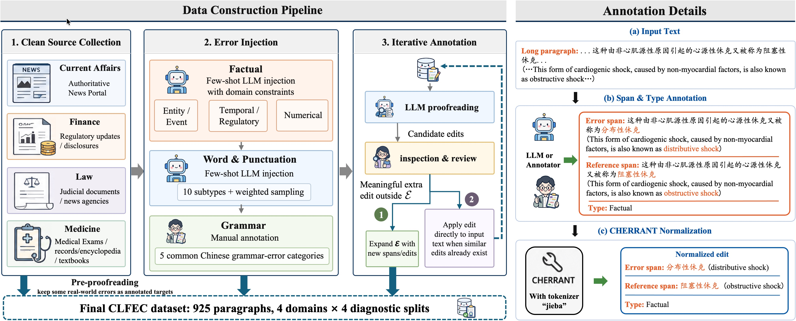

# CLFEC: Unified Linguistic and Factual Error Correction in Chinese Professional Writing

This repository contains the dataset, evaluation code, and supporting data
released with our paper:

> **CLFEC: A New Task for Unified Linguistic and Factual Error Correction
> in Paragraph-level Chinese Professional Writing.**

CLFEC is a paragraph-level Chinese proofreading benchmark that evaluates a
system's ability to **jointly** correct linguistic errors (Word, Grammar,
Punctuation) and factual errors in professional writing across four
domains: current affairs, finance, law, and medicine.

<p align="center">
  
  <br/>
  <em>Three-stage construction pipeline (clean source collection → error injection → iterative annotation) and the per-edit annotation flow that ends in a CHERRANT-normalized edit set.</em>
</p>

## Repository layout

```
CLFEC-release/
├── README.md                  ← you are here
├── data/                      ← the benchmark dataset
│   ├── CLFEC.json
│   └── README.md              ← dataset schema and statistics
├── eval/                      ← standardized evaluation pipeline
│   ├── normalize.py             step 1: normalize raw model output
│   ├── eval.py                  step 2: compute metrics against gold
│   ├── utils.py / annotator/    edit-pair → char-span normalization
│   ├── run_eval.sh              convenience wrapper (normalize + eval)
│   ├── requirements.txt
│   └── README.md              ← evaluation usage and metrics
└── commercial_data/           ← anonymized commercial-product outputs
    ├── error_map.json           per-product type → unified category mapping
    ├── on_clfec/                predictions on the 925 CLFEC paragraphs (Table 3)
    │   ├── raw/                   raw xlsx exports (P1/P2/P3)
    │   └── processed/             JSON aligned with CLFEC schema
    ├── on_corpus/               annotated candidates on source corpus (Motivation)
    │   ├── products_annotated.xlsx   sheets P1/P2/P3 with flags
    │   └── reproduce_motivation.py   reproduces motivation-figure numbers
    └── README.md
```

## Quick start

### 1. Get the dataset

The benchmark is `data/CLFEC.json` — 925 paragraphs across 4 domains and 4
diagnostic splits (`mix`, `lec_only`, `fec_only`, `no_error`). See
[`data/README.md`](data/README.md) for the schema and statistics.

### 2. Run your model

Generate corrections for each paragraph in `data/CLFEC.json`. Save them in
either:

- The **raw model-output format** (`{id, input_text, corrections: [{original, corrected}]}`) — let our pipeline normalize them; or
- The **standardized prediction format** (matches `CLFEC.json` schema with
  character-level `cors`) — skip normalization and call `eval.py` directly.

Both formats are documented in [`eval/README.md`](eval/README.md).

### 3. Evaluate

```bash
cd eval
pip install -r requirements.txt   # only needed for normalize.py
bash run_eval.sh /path/to/your_model_output.json ./results
```

This (i) standardizes your model's `(snippet, corrected_snippet)` pairs into
character-level edits using a CHERRANT-style aligner, and (ii) reports
detection / correction Precision · Recall · F1 under both strict and loose
span matching, broken down by sample type and error type.

## License

- **Code** (`eval/`): released under the MIT License.
- **Dataset** (`data/`): released for non-commercial research use only.
- **Commercial-product outputs** (`commercial_data/`): redistributed in
  anonymized form for research reproducibility; the products themselves
  remain the property of their respective vendors.

## Contact

For questions about the dataset or evaluation, please open an issue on this
repository or contact the authors via the paper's contact email.
